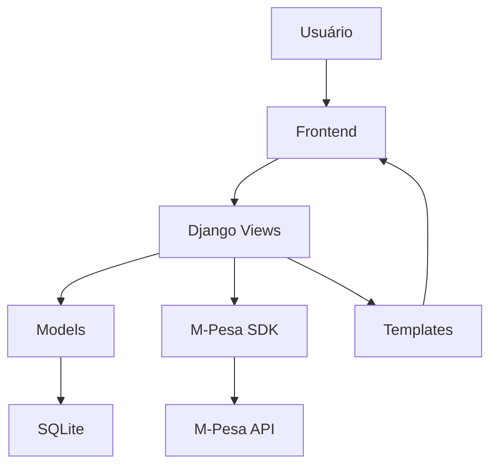

# 🎭 Sistema Carnaval da Beira - Documentação Completa

## 📋 Índice

1. [Visão Geral](#visão-geral)
2. [Arquitetura do Sistema](#arquitetura-do-sistema)
3. [Instalação e Configuração](#instalação-e-configuração)
4. [Funcionalidades](#funcionalidades)
5. [Modelos de Dados](#modelos-de-dados)
6. [APIs e Endpoints](#apis-e-endpoints)
7. [Integração M-Pesa](#integração-m-pesa)
8. [Interface Administrativa](#interface-administrativa)
9. [Frontend e Templates](#frontend-e-templates)
10. [Segurança](#segurança)
11. [Troubleshooting](#troubleshooting)
12. [Deployment](#deployment)

---

## 🎯 Visão Geral

### Descrição
Sistema web completo para gestão do **Carnaval da Beira 2025**, desenvolvido em Django com integração M-Pesa para votação paga. O sistema permite cadastro de grupos carnavalescos, sistema de votação com pagamento móvel, gestão de notícias e área administrativa completa.

### Tecnologias Principais
- **Backend**: Python 3.12 + Django 5.0
- **Database**: SQLite 3
- **Frontend**: Bootstrap 5 + JavaScript ES6
- **Payment**: M-Pesa API + SDK oficial
- **Rich Text**: CKEditor
- **Security**: Django Rate Limiting + CSRF

### Características Principais
- ✅ **Categorias Dinâmicas**: Sistema flexível de categorias
- ✅ **Pagamento M-Pesa**: Integração completa com SDK oficial
- ✅ **Gestão de Participantes**: Sistema inline no admin
- ✅ **Interface Responsiva**: Bootstrap 5 + WCAG 2.1 AA
- ✅ **Timezone Moçambique**: Africa/Maputo configurado
- ✅ **Sistema de Votação**: 1 voto por dispositivo/categoria
- ✅ **Admin Avançado**: Interface rica para gestão

---

## 🏗️ Arquitetura do Sistema

### Estrutura de Apps Django
```
carnaval_beira/
├── core/           # App principal (home, utilitários)
├── grupos/         # Gestão de grupos e categorias
├── noticias/       # Sistema de notícias
├── votacao/        # Sistema de votação e pagamentos
├── portalsdk/      # SDK oficial M-Pesa
├── static/         # Arquivos estáticos
├── templates/      # Templates Django
└── media/          # Uploads de usuários
```

### Fluxo de Dados


### Componentes Principais

#### 1. Core App
- **Função**: Página inicial e funcionalidades gerais
- **Views**: `home()`
- **Templates**: `core/home.html`
- **Responsabilidades**: Dashboard, estatísticas gerais

#### 2. Grupos App
- **Função**: Gestão de grupos carnavalescos e categorias
- **Models**: `Categoria`, `Grupo`, `Participante`
- **Views**: `lista_grupos()`, `detalhe_grupo()`
- **Templates**: `grupos/lista.html`, `grupos/detalhe.html`

#### 3. Notícias App
- **Função**: Sistema de notícias e comunicação
- **Models**: `Noticia`
- **Views**: `lista_noticias()`, `detalhe_noticia()`
- **Templates**: `noticias/lista.html`, `noticias/detalhe.html`

#### 4. Votação App
- **Função**: Sistema de votação com pagamento M-Pesa
- **Models**: `Voto`, `Payment`, `ResultadoVotacao`, `VotingSession`
- **Views**: `votar()`, `iniciar_pagamento()`, `verificar_pagamento()`
- **Services**: `MPesaService`

---

## ⚙️ Instalação e Configuração

### Pré-requisitos
```bash
# Sistema
- Python 3.12+
- pip
- Git

# Moçambique específico
- Credenciais M-Pesa válidas
- Número M-Pesa ativo para testes
```

### Instalação Passo a Passo

#### 1. Clone do Repositório
```bash
git clone <repository-url>
cd carnaval_beira
```

#### 2. Ambiente Virtual
```bash
python -m venv venv
source venv/bin/activate  # Linux/Mac
# ou
venv\Scripts\activate     # Windows
```

#### 3. Dependências
```bash
pip install -r requirements.txt
```

#### 4. Configuração do Ambiente
```bash
# Copie e configure
cp .env.example .env

# Edite .env com suas credenciais
nano .env
```

#### 5. Configuração do Banco
```bash
python manage.py migrate
python manage.py collectstatic
```

#### 6. Superusuário
```bash
python manage.py createsuperuser
```

#### 7. Dados Iniciais (Opcional)
```bash
python manage.py shell -c "
# Criar categorias padrão
from grupos.models import Categoria
Categoria.objects.create(
    nome='Escola de Samba',
    codigo='escola_samba',
    icone='bi-star-fill',
    cor_primaria='#dc3545',
    cor_secundaria='#fd7e14',
    ordem=1
)
"
```

### Arquivo .env
```env
# Django
SECRET_KEY=sua-chave-secreta-aqui
DEBUG=True

# M-Pesa Credentials
MPESA_API_KEY=sua-api-key-mpesa
MPESA_PUBLIC_KEY=sua-public-key-mpesa
MPESA_SERVICE_PROVIDER_CODE=171717

# Database (SQLite é padrão)
DATABASE_URL=sqlite:///db.sqlite3
```

### Execução
```bash
python manage.py runserver
```

Acesse: `http://localhost:8000`

---

## 🚀 Funcionalidades

### 1. Sistema de Categorias Dinâmicas

#### Características
- **Categorias Ilimitadas**: Adicione quantas categorias quiser
- **Personalização Visual**: Cores e ícones únicos
- **Ordem Customizável**: Defina ordem de exibição
- **Status Ativo/Inativo**: Controle de visibilidade

#### Campos do Modelo Categoria
```python
nome = CharField(max_length=50, unique=True)
codigo = SlugField(max_length=50, unique=True)  
descricao = TextField(blank=True)
icone = CharField(max_length=50, default="bi-people")
cor_primaria = CharField(max_length=7, default="#FF6B35")
cor_secundaria = CharField(max_length=7, default="#F7931E")
ativa = BooleanField(default=True)
ordem = PositiveIntegerField(default=0)
```

#### Exemplos de Categorias
1. **Escola de Samba**: Vermelho/Laranja, `bi-star-fill`
2. **Bloco de Rua**: Verde/Verde claro, `bi-people-fill`
3. **Banda Carnavalesca**: Roxo/Roxo claro, `bi-music-note`

### 2. Gestão de Grupos

#### Características
- **Informações Completas**: Nome, representante, contato, descrição
- **Categorização Automática**: Vinculação com categorias dinâmicas
- **Upload de Fotos**: Suporte a imagens
- **Controle de Status**: Ativo/Inativo

#### Validações
- **Nome Único**: Não permite grupos duplicados
- **Contato Validado**: Regex para telefone/email
- **Categoria Obrigatória**: Vinculação necessária

### 3. Sistema de Participantes

#### Características
- **Gestão Inline**: Adição direta no admin do grupo
- **Informações Detalhadas**: Nome, função, contatos, nascimento
- **Controle Individual**: Ativo/inativo por participante
- **Unicidade**: Sem nomes duplicados no mesmo grupo

#### Campos do Participante
```python
grupo = ForeignKey(Grupo)
nome = CharField(max_length=100)
funcao = CharField(max_length=50, blank=True)
telefone = CharField(max_length=20, blank=True)
email = EmailField(blank=True)
data_nascimento = DateField(blank=True, null=True)
ativo = BooleanField(default=True)
```

### 4. Sistema de Votação

#### Características
- **Pagamento Obrigatório**: 10 MZN via M-Pesa por voto
- **1 Voto por Categoria**: Por dispositivo identificado
- **Device Tracking**: SHA-256 hash de IP + User-Agent
- **Resultados em Tempo Real**: Atualização automática

#### Fluxo de Votação
1. **Seleção**: Usuário escolhe grupo
2. **Pagamento**: Insere número M-Pesa
3. **USSD**: Recebe notificação no telefone
4. **PIN**: Insere PIN em até 90 segundos
5. **Confirmação**: Sistema processa voto
6. **Resultado**: Voto computado e exibido

### 5. Integração M-Pesa

#### SDK Oficial
- **Autenticação RSA**: Criptografia de chave pública
- **Timeout Otimizado**: 90 segundos para PIN
- **Retry Logic**: Tentativas automáticas
- **Logs Detalhados**: Rastreamento completo

#### Códigos de Resposta
- **INS-0**: Sucesso
- **INS-9**: Timeout (PIN não inserido a tempo)
- **Outros**: Erros diversos (saldo, rede, etc.)

#### Configurações M-Pesa
```python
# settings.py
MPESA_API_URL = 'https://api.sandbox.vm.co.mz:18352'
MPESA_C2B_URL = f'{MPESA_API_URL}/ipg/v1x/c2bPayment/singleStage/'
VOTE_PRICE = '10'  # MZN
PAYMENT_TIMEOUT = 120  # segundos
```

### 6. Sistema de Notícias

#### Características
- **Rich Text Editor**: CKEditor integrado
- **Upload de Imagens**: Suporte multimedia
- **Sistema de Destaque**: Notícias em evidência
- **Controle de Publicação**: Publicada/Rascunho
- **Ordenação Cronológica**: Mais recentes primeiro

#### Campos da Notícia
```python
titulo = CharField(max_length=200)
conteudo = RichTextField()
imagem = ImageField(upload_to=noticia_image_upload_path)
data_publicacao = DateTimeField(default=timezone.now)
publicada = BooleanField(default=True)
destaque = BooleanField(default=False)
autor = CharField(max_length=100, blank=True)
```

---

## 📊 Modelos de Dados

### Diagrama ER Simplificado
```
Categoria ||--o{ Grupo : pertence
Grupo ||--o{ Participante : tem
Grupo ||--o{ Voto : recebe
Grupo ||--o{ Payment : relacionado
Categoria ||--o{ Voto : categoria
Categoria ||--o{ Payment : categoria
Categoria ||--o{ ResultadoVotacao : resultado
```

### Relacionamentos Detalhados

#### Categoria → Grupo (1:N)
- Uma categoria pode ter muitos grupos
- Um grupo pertence a uma categoria
- `on_delete=PROTECT` (não permite deletar categoria com grupos)

#### Grupo → Participante (1:N)
- Um grupo pode ter muitos participantes
- Um participante pertence a um grupo
- `on_delete=CASCADE` (remove participantes se grupo for removido)

#### Grupo → Voto (1:N)
- Um grupo pode receber muitos votos
- Um voto é para um grupo específico
- `on_delete=CASCADE`

#### Device → Voto (1:N por categoria)
- Um device pode votar uma vez por categoria
- Constraint: `unique_together = ['device_id', 'categoria']`

### Índices de Performance
```python
# Voto model indexes
indexes = [
    models.Index(fields=['categoria', 'grupo']),
    models.Index(fields=['device_id']),
    models.Index(fields=['timestamp']),
]

# Payment model indexes  
indexes = [
    models.Index(fields=['device_id', 'categoria']),
    models.Index(fields=['status']),
    models.Index(fields=['created_at']),
]
```

---

## 🔌 APIs e Endpoints

### URLs Principais

#### Core App
```python
# /
path('', views.home, name='home')
```

#### Grupos App
```python
# /grupos/
path('', views.lista_grupos, name='lista')
path('<int:grupo_id>/', views.detalhe_grupo, name='detalhe')
```

#### Notícias App
```python
# /noticias/
path('', views.lista_noticias, name='lista')
path('<int:noticia_id>/', views.detalhe_noticia, name='detalhe')
```

#### Votação App
```python
# /votacao/
path('', views.votar, name='votar')
path('processar/', views.processar_voto, name='processar_voto')
path('resultados/', views.resultados, name='resultados')
path('resultados/json/', views.resultados_json, name='resultados_json')
path('verificar/', views.verificar_voto, name='verificar_voto')

# Payment URLs
path('pagamento/iniciar/', views.iniciar_pagamento, name='iniciar_pagamento')
path('pagamento/verificar/', views.verificar_pagamento, name='verificar_pagamento')
```

### APIs REST

#### POST /votacao/pagamento/iniciar/
**Inicia processo de pagamento M-Pesa**

**Request:**
```json
{
  "phone_number": "258843001001",
  "grupo_id": 1,
  "categoria": "escola_samba"
}
```

**Response (Sucesso):**
```json
{
  "success": true,
  "payment_id": 123,
  "transaction_reference": "CV1234ABC567",
  "conversation_id": "abc123...",
  "message": "Pagamento processado com sucesso!"
}
```

**Response (Timeout):**
```json
{
  "success": false,
  "error": "Tempo limite esgotado. Insira o PIN M-Pesa mais rapidamente.",
  "timeout": true
}
```

#### GET /votacao/pagamento/verificar/?payment_id=123
**Verifica status do pagamento**

**Response:**
```json
{
  "status": "completed",
  "is_successful": true,
  "response_desc": "Request processed successfully",
  "vote_processed": true,
  "grupo_nome": "Unidos de Beira",
  "categoria": "Escola de Samba",
  "redirect_url": "/votacao/resultados/"
}
```

#### GET /votacao/resultados/json/
**Resultados em tempo real (AJAX)**

**Response:**
```json
{
  "escola_samba": {
    "nome": "Escola de Samba",
    "total_votos": 150,
    "grupos": [
      {
        "id": 1,
        "nome": "Unidos de Beira",
        "votos": 75,
        "porcentagem": 50.0
      }
    ]
  }
}
```

### Rate Limiting
```python
# Configurações aplicadas
@ratelimit(key='ip', rate='10/m', method=['POST'])  # Pagamentos
@ratelimit(key='ip', rate='30/m', method=['GET'])   # Verificações
@ratelimit(key='ip', rate='5/m', method=['POST'])   # Votos
```

---

Esta é a primeira parte da documentação. Continuarei com as seções restantes nos próximos arquivos para cobrir todos os aspectos do sistema em detalhes máximos.